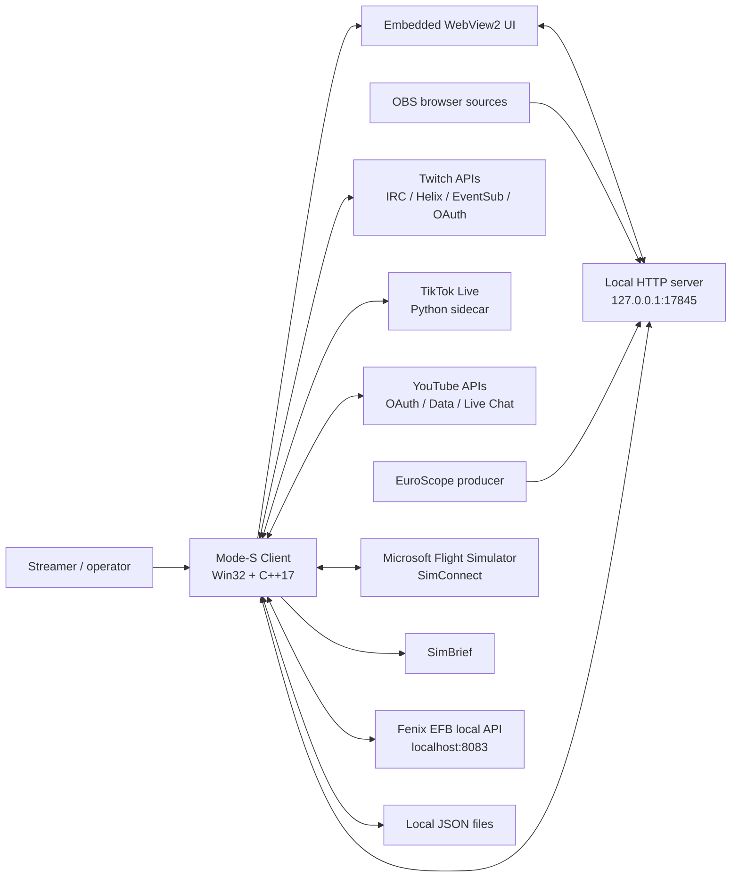
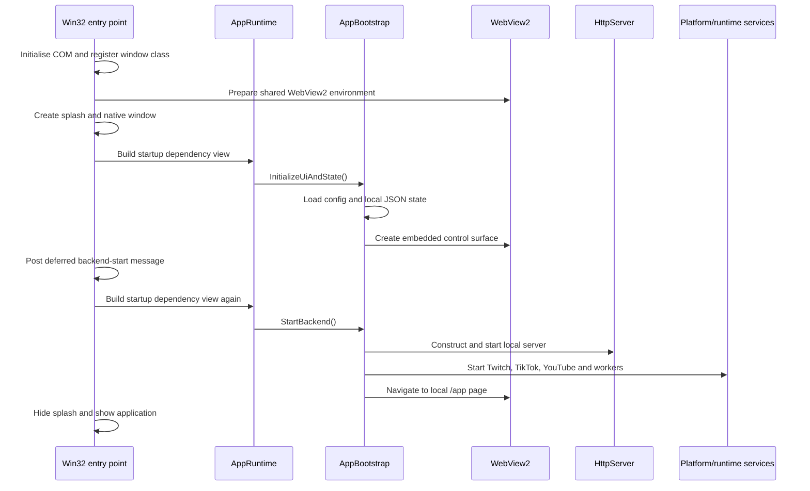

# Mode-S Client Architecture

## 1. Purpose

Mode-S Client is a Windows desktop application for running a multi-platform aviation livestream. It combines:

- Twitch, TikTok and YouTube chat and channel data
- a configurable chat-command bot
- local web pages for the desktop control surface
- OBS browser-source overlays
- EuroScope data ingestion
- Microsoft Flight Simulator data through SimConnect
- SimBrief flight-plan data
- optional Fenix aircraft failure automation driven by support events

The application is a **local control plane**, not a hosted service. The executable starts an HTTP server on the loopback interface and embeds its own web interface using WebView2. OBS normally consumes the same local server through browser sources.

This document describes the code as it currently exists. It also identifies incomplete or legacy components so that their presence is not mistaken for a working feature.

---

## 2. System context



The loopback HTTP server is the central integration surface inside the application. It serves the user interface and overlays, exposes application state as JSON, accepts local control requests, and receives EuroScope data.

---

## 3. Technology and build model

### Native application

- Windows desktop application
- C++17
- Win32 window and message loop
- Visual Studio project: `Mode-S Client/Mode-S Client.vcxproj`
- WebView2 for the embedded HTML user interface
- `cpp-httplib` for the embedded HTTP server and some HTTPS clients
- `nlohmann::json` for JSON parsing and serialization
- WinHTTP for several direct HTTP integrations
- OpenSSL support supplied through the NuGet package referenced by the project
- SimConnect SDK for Microsoft Flight Simulator integration

### Web and sidecar components

- HTML, CSS and JavaScript under `Mode-S Client/assets/`
- Python TikTok sidecar under `Mode-S Client/scripts/sidecar/`
- static overlay pages intended for OBS browser sources

### Build-time behaviour

The Visual Studio project runs `tools/gen_version.ps1` before compilation to create version information. Release builds copy the sidecar directory and static assets into the output directory.

The project currently contains machine-specific SimConnect SDK include and library paths. These are documented in `toberemoved.md` and must be replaced before another developer can build on a differently configured machine.

NuGet package restore is required for WebView2 and OpenSSL. The SimConnect SDK must be installed separately.

---

## 4. Source layout

```text
Mode-S Client/
├── src/
│   ├── Mode-S Client.cpp          Native entry point and Win32 shell
│   ├── AppConfig.h                Runtime configuration loading/saving
│   ├── AppState.*                 Shared application state
│   ├── app/                       Startup, runtime ownership and shutdown
│   ├── bot/                       Command dispatch and persistence wiring
│   ├── chat/                      Unified chat aggregator
│   ├── http/                      Local HTTP server and route wiring
│   ├── overlay/                   Overlay header persistence
│   ├── platform/                  Platform start/stop helpers
│   ├── runtime/                   Long-running service coordinators
│   ├── supporter/                 Recent supporter aggregation
│   └── ui/                        WebView, splash and native window helpers
├── integrations/
│   ├── euroscope/                 EuroScope JSON ingestion
│   ├── fenixsim/                  Fenix failure API and automation
│   ├── metar/                     AviationWeather METAR command
│   ├── obs/                       OBS WebSocket abstraction (currently a stub)
│   ├── simconnect/                Live MSFS aircraft data
│   ├── tiktok/                    Sidecar process wrapper and follower service
│   ├── twitch/                    OAuth, IRC, Helix and EventSub
│   └── youtube/                   OAuth, stats, live status and live chat
├── assets/
│   ├── app/                       Embedded control surface
│   ├── overlay/                   OBS browser-source pages
│   └── icons/                     Application and platform artwork
├── scripts/sidecar/               Python sidecars and bundled dependencies
├── bot_commands.json              Default bot commands
└── config.example.json            Example local account configuration
```

---

## 5. Runtime ownership

`AppRuntime` is the long-lived owner of almost all services and shared objects. A single global `AppRuntime` instance is created in `Mode-S Client.cpp` and remains alive until process exit.

It owns:

- `AppConfig`
- `AppState`
- `ChatAggregator`
- Twitch IRC, EventSub and OAuth clients
- YouTube OAuth and live-chat services
- TikTok sidecar wrapper
- the local HTTP server
- EuroScope ingest state
- SimBrief and SimConnect indirectly through the HTTP server
- the Fenix failure API client and coordinator
- the OBS client abstraction
- worker threads and atomic lifecycle flags

This central ownership is important. Asynchronous callbacks must capture the long-lived objects themselves, not temporary dependency-wrapper objects created during startup.

### Startup sequence



The backend start is deferred until after native window creation. This allows the window procedure to finish before worker services and WebView navigation begin.

### Shutdown sequence

`AppShutdown::BeginShutdown()` is guarded by an atomic flag and can safely be called from both `WM_CLOSE` and the `WM_DESTROY` fallback path.

The intended order is:

1. set shared running flags to false;
2. stop and destroy the HTTP server;
3. join the TikTok follower, Twitch Helix and metrics threads;
4. stop Fenix automation;
5. stop Twitch EventSub, OAuth and IRC;
6. stop YouTube chat and runtime services;
7. stop TikTok;
8. destroy the native window and leave the Win32 message loop.

Any new long-running component must be added to both runtime ownership and orderly shutdown.

---

## 6. Shared state and data flow

### `AppState`

`AppState` is the shared in-memory model exposed to the web UI and overlays. Its responsibilities include:

- aggregate viewer, follower and live-state metrics;
- recent logs;
- Twitch EventSub diagnostics and event queues;
- TikTok and YouTube event queues;
- unified alert history and replay;
- EuroScope tag events;
- platform requested-state tracking;
- bot commands and bot safety settings;
- bot reply events for overlays;
- overlay title and subtitle;
- Twitch stream-information draft data;
- Twitch Channel Points reward actions, pending items and history.

Most collections are bounded queues or snapshots protected by mutexes. State is predominantly process-local. Selected configuration is persisted to JSON files.

### `ChatAggregator`

All supported chat sources are converted into a common `ChatMessage` structure and inserted into `ChatAggregator`.

```mermaid
flowchart TD
    TI[Twitch IRC / EventSub]
    TK[TikTok sidecar]
    YT[YouTube live chat]
    CA[ChatAggregator]
    Ring[Bounded recent-message ring]
    Bot[BotCommandDispatcher]
    API[/api/chat and overlay consumers]

    TI --> CA
    TK --> CA
    YT --> CA
    CA --> Ring
    CA --> Bot
    Ring --> API
    Bot --> TI
    Bot --> YT
    Bot --> API
```

`ChatAggregator::Add()` updates the ring while holding its mutex, then invokes its subscriber outside the lock. The subscriber currently drives command handling.

The bot sends native replies to Twitch and YouTube. TikTok command replies are overlay-only in the default implementation because native sending depends on a paid third-party route.

---

## 7. Local HTTP server

The server binds to `127.0.0.1` on port `17845`. The embedded WebView navigates to:

```text
http://127.0.0.1:17845/app
```

OBS browser sources use pages under `/overlay/` on the same server.

The route implementation is concentrated in `src/http/HttpServer.cpp`. Its route families include:

- application logs and diagnostics;
- aggregate metrics and EuroScope status;
- recent chat and alert history;
- bot command/settings management and test injection;
- platform runtime status and start/stop control;
- account configuration and OAuth callbacks;
- Twitch stream information, EventSub, Channel Points and rewards;
- YouTube live/VOD operations;
- recent supporter aggregation;
- SimBrief and SimConnect snapshots;
- overlay header/configuration;
- Fenix simulator-automation status and emergency controls;
- static application and overlay assets.

`HttpServerOptionsBuilder` keeps platform-specific callbacks out of the server constructor. It wires the server to the long-lived clients owned by `AppRuntime`.

### Trust boundary

The loopback-only bind is a meaningful security boundary because many routes change local state or invoke platform APIs. A future change to bind on all interfaces must not be made without adding authentication, authorization, request validation and cross-site request protections.

---

## 8. Platform integrations

### Twitch

The Twitch implementation has four main parts:

- `TwitchAuth`: OAuth authorization, refresh, validation and token persistence;
- `TwitchIrcWsClient`: chat ingestion and message sending;
- `TwitchHelixService` / controller: followers, viewers, channel data and channel updates;
- `TwitchEventSubWsClient`: subscriptions, events, Channel Points and diagnostics.

The OAuth application client ID and secret are expected through the ignored local header `src/oauth/EmbeddedOAuthConfig.local.h`. User access and refresh tokens are stored in local `config.json`.

Changing `twitch_login` can cause the Helix poller and chat/EventSub clients to be rebound to another channel. A new owner must create and authorize their own Twitch application rather than inherit the previous owner's credentials.

### TikTok

TikTok is implemented as a Python child process using the `TikTokLive` package. The C++ process communicates with it through newline-delimited JSON over redirected standard input/output pipes.

The sidecar reads:

- TikTok unique ID;
- `sessionid` or `sessionid_ss`;
- `tt_target_idc` where available.

It emits normalized chat, follow, gift, like, share, subscription, viewer and status events. The C++ wrapper parses each JSON line and passes it into application state/chat.

The sidecar and its Python dependencies must be distributed with the executable. TikTok cookies are sensitive account credentials and must not be committed or transferred without explicit authorization.

### YouTube

The active implementation is native C++ and consists of:

- OAuth and token refresh;
- channel-statistics polling;
- live-status discovery;
- live-chat ingestion and replies;
- selected VOD/live-management routes in the HTTP server.

Google OAuth client credentials are supplied through the same ignored local OAuth header mechanism. Tokens, channel ID and handle are stored locally in `config.json`.

`YouTubeSidecar.*` and `youtube_sidecar.py` remain in the project, but no active runtime wiring was found during the handover audit. They should be treated as legacy until proven otherwise.

---

## 9. Aviation and simulator integrations

### EuroScope

`EuroScopeIngestService` accepts JSON generated by an external EuroScope-side producer. The payload must include `ts_ms`. The most recent payload is held in memory and merged into `/api/metrics`.

Connectivity is inferred from the age of the last payload; there is no VATSIM account login in this client-side ingest service.

### METAR

The `!metar ICAO` bot command calls the public AviationWeather API and caches each station result for one minute. It does not use a personal API key.

### SimConnect

The SimConnect worker repeatedly attempts to attach to the local Microsoft Flight Simulator session. It requests:

- pressure/plane altitude;
- ground speed;
- indicated airspeed;
- latitude;
- longitude.

The worker stores a thread-safe snapshot consumed by HTTP routes and overlays. Build-time access to the SimConnect headers and library is required.

### SimBrief

The HTTP server runs a background worker that requests the latest SimBrief plan every ten minutes and reduces it to a small cache containing callsign, origin, destination, route distance and coordinates.

The current pilot ID is hardcoded to the original operator's account. This is a takeover blocker and is listed in `toberemoved.md`.

### Fenix failure automation

The Fenix integration calls a local HTTP API at `localhost:8083` to read, arm, trigger and clear manual aircraft failures.

`FenixFailureCoordinator` watches monetization/support events from Twitch, TikTok and YouTube, converts eligible events into credits, and can spend those credits on random failures. The current selection split is 60% immediate and 40% armed/delayed. Automation starts disabled and provides a panic-stop operation that disables further actions and attempts to clear active/armed failures.

Failure metadata is generated and merged with the failures discovered from the local Fenix endpoint.

This feature is stream-policy-specific and should be reviewed before being enabled by a new operator.

---

## 10. OBS integration

The working OBS integration is the set of browser-source overlays served by the local HTTP server.

There is also an `ObsMetricsPublisher` worker that attempts to update OBS text inputs every five seconds. However, `ObsWsClient` is currently a stub: `connect()` always returns false and `set_text()` performs no operation. The text-input publisher must therefore be considered non-functional until a real OBS WebSocket client is implemented.

---

## 11. Configuration and persistence

### Files expected beside the executable or working directory

| File | Purpose | Source controlled? |
|---|---|---:|
| `config.json` | Platform identities, cookies, OAuth tokens, UI settings and cached values | No |
| `bot_commands.json` | Chat command definitions | Default file is tracked; runtime copy may change |
| `bot_settings.json` | Rate limits, maximum reply length and silent mode | Normally local |
| `overlay_header.json` | Overlay title/subtitle | Normally local |
| `twitch_streaminfo.json` | Twitch stream draft and currently some YouTube VOD draft data | Normally local |
| Fenix failure metadata JSON | Generated/edited failure policy metadata | Local/generated |
| `EmbeddedOAuthConfig.local.h` | Twitch and Google OAuth client credentials | No |

`AppConfig` searches the current working directory first and then the executable directory. This can lead to different configuration files being used depending on how the application is launched. A successor should standardize the data directory before distributing the application more widely.

### Sensitive data

The current design stores platform tokens and TikTok cookies in plaintext local files. They are excluded from Git but are not encrypted at rest. A production-quality handover should migrate secrets to Windows Credential Manager or another operating-system-backed secret store.

---

## 12. Threads and asynchronous components

The application may have the following concurrent activity:

- Win32/WebView UI thread;
- embedded HTTP server thread;
- SimBrief refresh thread;
- SimConnect worker thread;
- Twitch OAuth refresh worker;
- Twitch IRC WebSocket worker;
- Twitch EventSub WebSocket worker;
- Twitch Helix polling thread;
- TikTok Python child process and C++ reader thread;
- TikTok follower polling thread;
- YouTube OAuth/statistics/live-status/live-chat workers;
- Fenix failure coordinator thread;
- OBS metrics publisher thread.

Rules for future changes:

1. long-running objects must be owned by `AppRuntime` or another clearly longer-lived owner;
2. callbacks must not capture temporary dependency wrappers by reference;
3. mutable cross-thread state must remain protected by mutexes or atomics;
4. every new thread/service must have a defined stop operation and be included in shutdown;
5. callbacks should not perform slow work while holding `AppState` or aggregator locks.

---

## 13. Known incomplete or legacy areas

- `ObsWsClient` is a no-op stub.
- `YouTubeSidecar` and `youtube_sidecar.py` appear to be legacy and are not wired into the current startup path.
- `AppRuntime` contains an additional member named `youtube` whose type is `TikTokSidecar`; it is not part of the current bootstrap dependency set and appears to be a remnant.
- `HttpServer.cpp` is a large monolithic route implementation and contains unrelated persistence/API helpers.
- Some comments and diagnostics describe older configuration mechanisms.
- Some YouTube VOD draft data is stored in a file named `twitch_streaminfo.json`.
- There is no functioning OBS WebSocket transport despite the publisher thread.
- No automated test project or GitHub Actions workflow was identified during this documentation audit.
- The repository currently states that its licence is not finalised. Licensing must be resolved before a formal transfer or third-party distribution.

---

## 14. Takeover checklist

A new maintainer should complete the following before using the client with real accounts:

1. Read `toberemoved.md` and remove or parameterize every original-owner dependency.
2. Create new Twitch and Google OAuth applications and update allowed redirect URLs.
3. Generate a new ignored `EmbeddedOAuthConfig.local.h` from a documented template.
4. Start with a clean `config.json`; do not reuse the previous owner's tokens or TikTok cookies.
5. Replace all RadarController/StreamingATC branding and visual assets.
6. Replace the hardcoded SimBrief pilot ID.
7. replace the machine-specific SimConnect SDK paths with portable project properties or environment variables.
8. Restore NuGet packages and build Debug x64 and Release x64.
9. Smoke-test the local UI and overlays before connecting social accounts.
10. Test one platform at a time, then combined chat and alert handling.
11. Keep Fenix automation disabled until its support-event policy and failure mappings have been reviewed.
12. Revoke any credentials belonging to the previous operator.
13. Choose and document an open-source or transfer licence before publication or redistribution.

For guidance on using AI to maintain this repository, see `agents.md`.